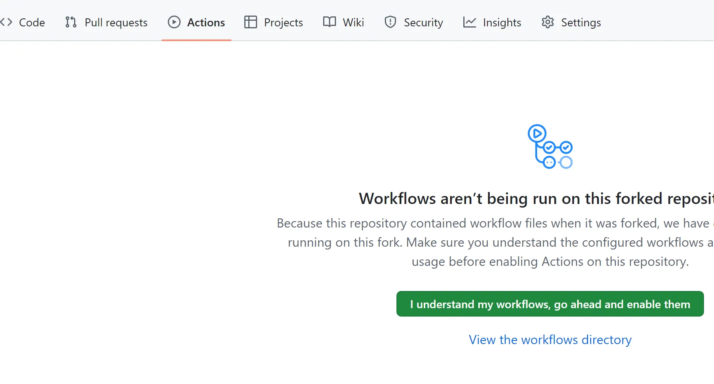
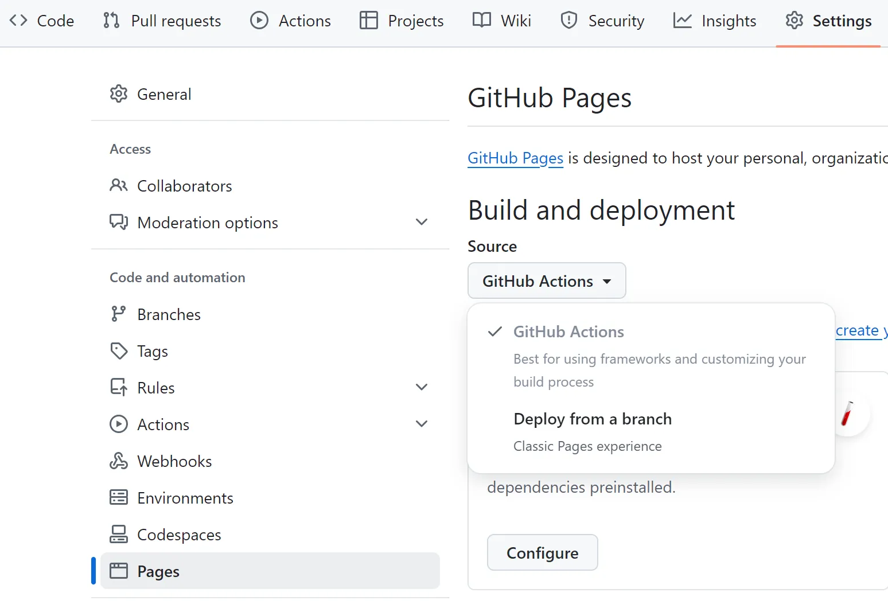
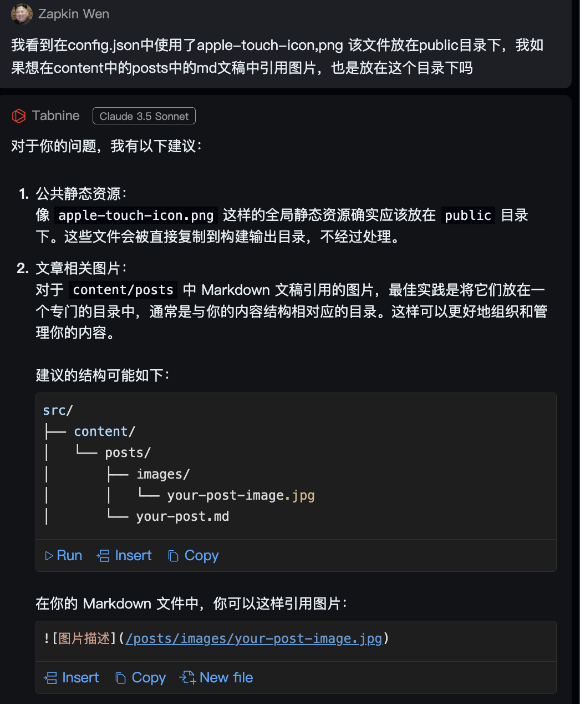

## 概述

本文介绍了如何通过Astro配合免费页面模版，使用Github Pages，**免服务器、免域名、免费、** *基本免代码*地搭建一个属于自己的个人博客页面。写博客只需要通过markdown语法就能轻松完成

### 效果预览

你现在看到的这个网站就是通过本文所述方式搭建，如果你想看看Astro还能提供哪些形式的页面和功能，可以去Astro的[模版页面](https://astro.build/themes/)瞅瞅看

## 前置条件

- 有一个Github账户
- 有一个大致还能用的脑子
- **比较良好的网络环境**

## 本地环境部署

### 安装pnmp-以mac为例

因为我使用的[模版](https://github.com/lxchapu/astro-gyoza)推荐使用[pnpm](https://pnpm.io/zh)作为包管理器；因此在安装Astro需要首先安装**pnpm**，当然，即使你要使用其他模版，也推荐你先安装pnpm

打开[pnpm安装文档](https://pnpm.io/zh/installation)，可以看到针对不同操作系统的各种安装方式

我使用的是已经安装了[HomeBrew](https://brew.sh/)的Mac，因此我选择通过brew进行安装

```sh
brew install pnpm
```

### 安装Astro及模版

进入[Astro官网](https://docs.astro.build/zh-cn/getting-started/)，点击**安装Astro**就能打开官方的安装文档链接。可以看到不用单独安装Astro，克隆想要使用的模版之后直接执行`pnpm install`命令即可

登录 Github 账号，打开 [lxchapu/astro-gyoza](https://github.com/lxchapu/astro-gyoza)，点击右上角的 Fork 按钮，将仓库克隆到你自己的账号下。如果想使用其他模版，请在Astro[模版页面](https://astro.build/themes/)进行选择

**请注意**，为了保证后面进行Github Pages配置的简便性，**请确保你Fork时的仓库名为**`github用户名.github.io`

复制这个仓库的地址，打开终端，使用 `git clone` 命令将仓库克隆到本地。如果你还没有安装安装git，请参照[安装教程](https://www.runoob.com/git/git-install-setup.html)进行安装和配置

### 本地运行

在工程目录中打开终端，输入以下命令即可安装依赖

```sh
pnpm install
```

再输入以下指令即可本地运行

```sh
pnpm dev
```

在浏览器地址栏打开地址`http://localhost:4321/`就可看到实际效果

---

## 部署在Github上

具体详细说明可参考[官方链接](https://docs.astro.build/zh-cn/guides/deploy/github/)

首先需要对项目配置文件进行更改，请找到工程目录下的`astro.config.mjs`(对于我使用的模版来说，叫做`astro.config.js`)

```js
import { defineConfig } from 'astro/config'

export default defineConfig({
  site: 'https://astronaut.github.io',
})
```

请将**site**中的网址更改为`你的Github用户名.github.io`

在项目的`.github/workflows/`目录创建一个新文件`deploy/yml`,并粘贴以下YAML配置信息

```yml
name: Deploy to GitHub Pages

on:
  # 每次推送到 `main` 分支时触发这个“工作流程”
  # 如果你使用了别的分支名，请按需将 `main` 替换成你的分支名
  push:
    branches: [main]
  # 允许你在 GitHub 上的 Actions 标签中手动触发此“工作流程”
  workflow_dispatch:

# 允许 job 克隆 repo 并创建一个 page deployment
permissions:
  contents: read
  pages: write
  id-token: write

jobs:
  build:
    runs-on: ubuntu-latest
    steps:
      - name: Checkout your repository using git
        uses: actions/checkout@v4
      - name: Install, build, and upload your site
        uses: withastro/action@v3
        # with:
        # path: . # 存储库中 Astro 项目的根位置。（可选）
        # node-version: 20 # 用于构建站点的特定 Node.js 版本，默认为 20。（可选）
        # package-manager: pnpm@latest # 应使用哪个 Node.js 包管理器来安装依赖项和构建站点。会根据存储库中的 lockfile 自动检测。（可选）

  deploy:
    needs: build
    runs-on: ubuntu-latest
    environment:
      name: github-pages
      url: ${{ steps.deployment.outputs.page_url }}
    steps:
      - name: Deploy to GitHub Pages
        id: deployment
        uses: actions/deploy-pages@v4
```

然后打开你Fork到自己账户下的仓库主页，点击`Actions`



点击`Settings`，选择左侧菜单的`Pages`,将其中的Source更改为**Github Action**



## 上传测试

要做的工作基本结束啦，现在只需要Commit并提交至github，刚刚设定的Github Action就会自动构建网站，并在指定的网址发布啦

但是在commit过程中我遇到了报错，原因是我使用的模版对git commit的格式提出了要求，我的commit信息必须符合条件才可以

```bash
type: subject
```

其中：
type 是提交类型，必须是以下之一：

- feat: 新功能
- fix: 修复bug
- docs: 文档更改
- style: 代码格式修改
- refactor: 代码重构
- perf: 性能优化
- test: 测试相关
- chore: 构建过程或辅助工具的变动

commit后，push到GitHub，稍等一分钟打开你的主页，就能看到网站啦！

## 补充说明

### 如何在md中添加文件

当我开心地在markdown中插入图片时，却遇上了诸多问题，例如，**图片应该放在哪里，怎么构建失败了？**

1. 图片应该放在哪里

我一开始看到其他ts文件中，引用favicon时，favicon是放在public目录下的，但是我还是咨询了claude，它告诉我图片最好放在专门的目录下，与内容结构相对应，以更好地管理我的内容。



2. 构建怎么失败了

当我push我更新后的工程至Github之后，却发现页面构建失败，返回的错误信息中有一句`Could not find Sharp. Please install Sharp manually into your project or migrate to another image service.`

Claude给我的解决方案如下：

首先在终端执行该命令，安装sharp

```sh
pnpm add sharp
```

然后在项目的package.json的dependencies中添加`"sharp": "^0.32.1"`。
最后再commit并push，等待构建完成就可以啦，本篇文章中所看到的图片就是使用这种方式添加的。
